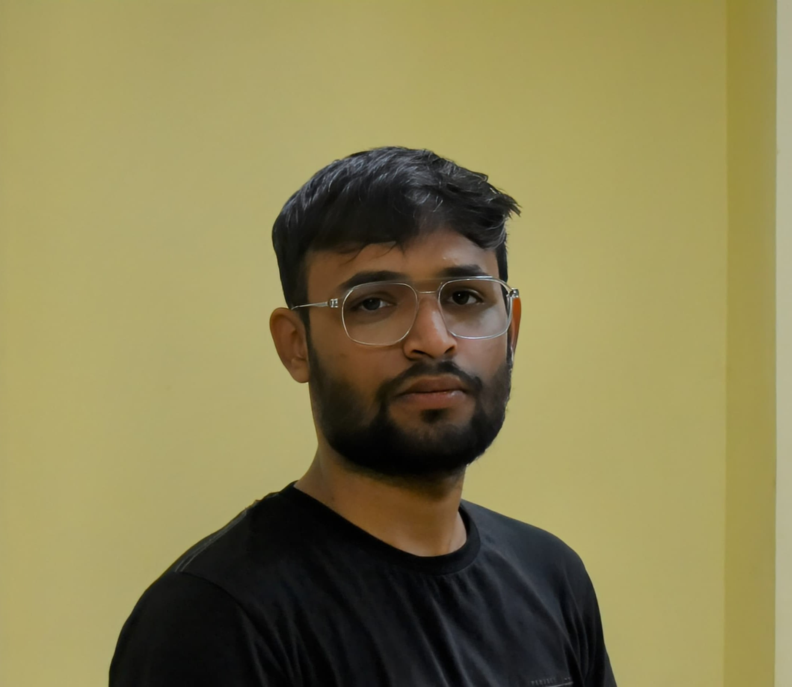

# Hi there, I'm Sandeep 👋

## About Me

I'm a passionate software developer with expertise in MERN Full Stack Development. I love creating innovative solutions and sharing my knowledge with the community.

- 🌱 I’m currently learning Solidity
- 💬 Ask me about anything web
- 📫 How to reach me: [sandy1711003@gmail.com](mailto:sandy1711003@gmail.com)

- 😉 Portfolio: [Sandeep Singh](https://portfolio-website-lovat.vercel.app/)
## 🚀 Projects

### [Project 1](https://github.com/your-username/project-1)
- **Description:** Brief description of what the project does.
- **Tech Stack:** List the technologies used.
- **Highlights:** Mention any key features or achievements.

### [Project 2](https://github.com/your-username/project-2)
- **Description:** Brief description of what the project does.
- **Tech Stack:** List the technologies used.
- **Highlights:** Mention any key features or achievements.

### [Project 3](https://github.com/your-username/project-3)
- **Description:** Brief description of what the project does.
- **Tech Stack:** List the technologies used.
- **Highlights:** Mention any key features or achievements.

## 📝 Blog Posts

I enjoy writing about technology and sharing insights:

- [Blog Post 1](https://yourblog.com/post-1)
- [Blog Post 2](https://yourblog.com/post-2)
- [Blog Post 3](https://yourblog.com/post-3)

## 📫 Get in Touch

- **Email:** [sandy1711003@gmail.comm](mailto:sandy1711003@gmail.comm)
- **LinkedIn:** [Sandeep Singh](https://www.linkedin.com/in/sandeep-singh-445058254/)
- **Twitter:** [@sandy1711003](https://x.com/sandy1711003)

